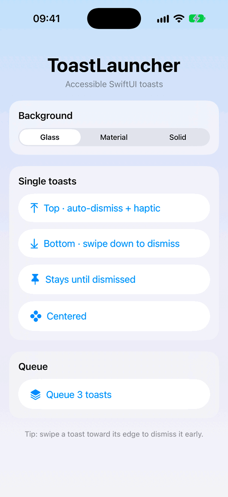

# ToastLauncher

Accessible, swipeable SwiftUI toasts with auto-dismiss, queueing, and Liquid Glass — in one modifier.

<p align="center">
  <!-- TODO: Replace with a 15–20s demo recorded from the Example app. -->
  
</p>


## Features

- **One modifier** — `.toast(isPresented:)` works like `.sheet`, with any SwiftUI view as content.
- **Auto-dismiss** — configurable duration, or stay until dismissed. Timers cancel cleanly.
- **Drag to dismiss** — swipe toward the toast's edge; it springs back if you don't swipe far enough.
- **Queueing** — `ToastQueue` shows toasts one after another instead of stacking them.
- **Liquid Glass** — on iOS 26 and later, with a material fallback on earlier versions.
- **Accessible** — VoiceOver announcements, Dynamic Type, and Reduce Motion support.
- **Haptics** — optional success, warning, or error feedback.
- **Swift 6** — strict concurrency, no `@unchecked Sendable`.

## Installation

Add ToastLauncher with Swift Package Manager. In Xcode, choose **File › Add Package Dependencies…** and enter:

```
https://github.com/theswaolincode/ToastLauncher
```

Or add it to your `Package.swift`:

```swift
dependencies: [
    .package(url: "https://github.com/theswaolincode/ToastLauncher", from: "2.0.0")
]
```

## Usage

```swift
import ToastLauncher
```

### Basic

```swift
@State private var isSaved = false

var body: some View {
    Button("Save") { isSaved = true }
        .toast(isPresented: $isSaved) {
            ToastView(title: "Saved", symbolName: "checkmark.circle.fill", style: .auto) {
                isSaved = false
            }
        }
}
```

The toast slides in from the top, dismisses itself after 3 seconds, and can be swiped up to dismiss early.

### Auto-dismiss

```swift
// Stays for 5 seconds.
.toast(isPresented: $isSynced, duration: 5) { SyncedBadge() }

// Stays until the person dismisses it.
.toast(isPresented: $isOffline, duration: nil) {
    ToastView(title: "You're offline", symbolName: "wifi.slash",
              buttonTitle: "OK", style: .prominent) {
        isOffline = false
    }
}
```

### Alignment

```swift
.toast(isPresented: $isCopied, alignment: .bottom, haptic: .success) {
    Text("Copied to clipboard")
        .padding()
        .toastBackground(.material)
}
```

The alignment also sets the swipe direction: bottom toasts are swiped down, leading and trailing toasts sideways.

### Liquid Glass

```swift
.toast(isPresented: $isDownloaded) {
    Label("Download complete", systemImage: "arrow.down.circle.fill")
        .padding()
        .toastBackground(.glass)
        .toastAnnouncement("Download complete")
}
```

`.toastBackground(_:)` works on any view. `.glass` uses Liquid Glass on iOS 26 and later and falls back to a translucent material on earlier versions.

### More

- **Queue toasts:** create a `@StateObject private var toasts = ToastQueue()`, attach `.toastQueue(toasts)`, and call `toasts.enqueue { … }`.
- **Full documentation:** in Xcode, choose **Product › Build Documentation** to open the DocC reference and the Getting Started guide.

## Accessibility

- **VoiceOver** — `ToastView` announces its title when it appears; add `.toastAnnouncement(_:)` to custom content. Announcements are queued, so they don't cut off what VoiceOver is already saying.
- **Time to respond** — while VoiceOver is running, short durations are extended to at least 10 seconds.
- **Dismissal** — each toast is one accessibility container, and the VoiceOver escape gesture (two-finger scrub) dismisses it.
- **Dynamic Type** — `ToastView`'s text, icon, and spacing scale with the person's text size, and the message wraps instead of truncating.
- **Reduce Motion** — toasts fade instead of sliding or scaling.

## Requirements

- iOS 15.0+
- Xcode 26+ (Swift 6). Liquid Glass needs the iOS 26 SDK to compile; apps still run on iOS 15.

## Migrating from 1.x

The original `.toastView(isPresented:alignment:animationStart:animationEnd:onDismiss:content:)` still works and behaves as before. Switch to `.toast(isPresented:)` to get auto-dismiss, drag-to-dismiss, haptics, and built-in animations.

## License

ToastLauncher is available under the MIT license. See [LICENSE.md](LICENSE.md) for details.

Created by [Daniel Ayala](https://github.com/theswaolincode).
